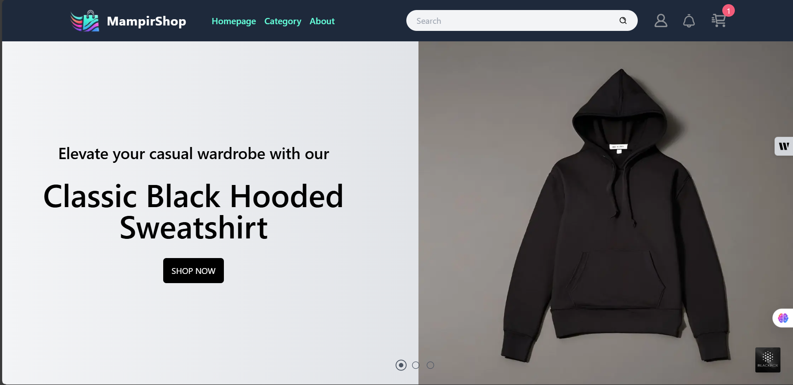

# Hello, I'm Muhammad Syifa Surya Saputra 👋

Im a Front-End Developer with a strong passion for creating digital experiences that are user-friendly, efficient, and accessible. I'm currently focusing on enhancing my skills in Software Engineering, particularly front-end development, and continuously learning to improve my craft. This website is a personal portfolio showcasing my skills, projects, and journey as a developer.

- **Email**: syifamuhammad3139@example.com
- **LinkedIn**: [LinkedIn Profile](https://www.linkedin.com/in/muhammadsyifasuryasaputra/)
- **GitHub**: [GitHub Profile](https://github.com/Muhammadsyifasurya)

---

## 🌐 About This Website

**MampirShop** is a responsive online store built with React and Next.js. It features a modern design with various interactive sections, including a product listing page, user authentication (login/register), product categories, and a shopping cart. The website is optimized for a seamless experience across devices, ensuring users can browse, filter, and manage products with ease.

Key features include:

- A dynamic product listing fetched from an API
- User authentication (login and registration)
- Category-based product filtering
- Detailed product pages
- Shopping cart management

The application leverages modern web technologies for enhanced performance, using **server-side rendering (SSR)** with Next.js for fast loading times and improved SEO.

[View the live version here](https://mampirshopv2.vercel.app/)

## New Features Implemented

- **Next.js Integration**: Integrated Next.js for optimized routing and efficient server-side rendering (SSR).
- **User Authentication**: Implemented login and registration functionalities using a provided API, allowing users to securely access their accounts.
- **Product Listings**: Developed pages to display products fetched from the API with detailed images, descriptions, and prices.
- **Category Filtering**: Enabled product filtering based on categories to improve product discoverability.
- **Shopping Cart**: Created a cart system where users can add products, view their selections, and manage the cart.
- **Unit Testing**: Wrote unit tests for key components using Jest and the Next.js Testing Library to ensure functionality and reliability.

This is a [Next.js](https://nextjs.org) project bootstrapped with [`create-next-app`](https://nextjs.org/docs/app/api-reference/cli/create-next-app).

## ⚙️ How to Setup

To get this project running on your local machine, follow these steps:

1. **Clone the Repository**  
   Use the following command to clone the repository:

   ```bash
   git clone https://github.com/Muhammadsyifasurya/mampirshopv2.git
   ```

2. **Enter to the folder**

   ```bash
   cd mampirshopv2
   ```

3. **Open with Visual Studio Code**

   ```bash
   code .
   ```

4. **Run project**

   ```bash
   npm run dev
   ```

## 🧪 Testing Methodologies Used

### Types of Testing:

1. **Unit Testing**:
   - Focuses on testing individual functions or components to ensure they behave as expected.
   - Example: Verifying that the login function correctly validates user credentials.
2. **Integration Testing**:
   - Ensures that components work together seamlessly.
   - Example: Testing the interaction between the product listing and shopping cart.

### Tool Used:

- **Jest**: A JavaScript testing framework designed for simplicity and support for React applications.

### 🛠️ Setting Up Jest

Jest is a powerful testing framework for JavaScript applications. This guide explains how to install Jest, configure it, and write your first tests.

1.  **Quickstart** :

    To quickly set up Jest, run the following command to generate a new project with Jest pre-configured:

    ```bash
    npx create-next-app@latest --example with-jest with-jest-app
    ```

2.  **Manual Setup** :

    If you prefer setting up Jest manually, follow these steps:

- **Install Jest and Dependencies**

  Install jest and related packages as development dependencies:

  ```bash
  npm install -D jest jest-environment-jsdom @testing-library/react @testing-library/dom @testing-library/jest-dom ts-node
  ```

- **Generate a Jest Configuration File**

  ```bash
  npm init jest@latest
  ```

- **Update the Jest Configuration**

  ```typescript
  import type { Config } from "jest";
  import nextJest from "next/jest";

  const createJestConfig = nextJest({
    // Provide the path to your Next.js app to load next.config.js and .env files
    dir: "./",
  });

  const config: Config = {
    coverageProvider: "v8", // Specify coverage provider
    testEnvironment: "jsdom", // Use jsdom for testing browser-like environments
    // Optional: Add setup scripts to run before each test
    setupFilesAfterEnv: ["<rootDir>/jest.setup.ts"],
  };

  export default createJestConfig(config);
  ```

- **Write Your First Test**

  Create a test file, for example : `__tests__/example.test.js`, and add the following code:

  ```typescript
  import { render, screen } from "@testing-library/react";
  import Home from "../pages/index";
  test("renders the home page", () => {
    render(<Home />);
    const heading = screen.getByText(/welcome to next\.js/i);
    expect(heading).toBeInTheDocument();
  });
  ```

3.  **Run Test**:

    ```bash
    npm test
    ```

## Learn More

To learn more about Next.js, take a look at the following resources:

- [Next.js Documentation](https://nextjs.org/docs) - learn about Next.js features and API.
- [Learn Next.js](https://nextjs.org/learn) - an interactive Next.js tutorial.

You can check out [the Next.js GitHub repository](https://github.com/vercel/next.js) - your feedback and contributions are welcome!

## Deploy on Vercel

The easiest way to deploy your Next.js app is to use the [Vercel Platform](https://vercel.com/new?utm_medium=default-template&filter=next.js&utm_source=create-next-app&utm_campaign=create-next-app-readme) from the creators of Next.js.

Check out our [Next.js deployment documentation](https://nextjs.org/docs/app/building-your-application/deploying) for more details.
